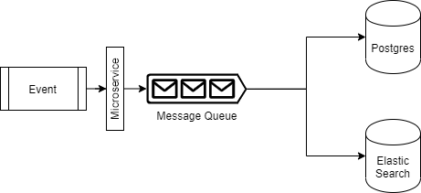

# Backend Assessment

## Merhaba

Bu değerlendirme işe başvuru sürecindeki adaylar için hazırlanmış olup, katılacak kimselerin yaklaşım ve yetkinliklerini değerlendirmede bizlere yardımcı olmak için tasarlanmıştır.

Değerlendirme dahilinde; belirtilen süre içerisinde aşağıda kapsamı ve detayları belirlenmiş projeyi tamamlamanızı beklemekteyiz. Dikkat edebileceğiniz bir diğer husus ise, bizlerin doğru bir değerlendirme yapmamıza yardımcı olacak şekilde iletebileceğiniz en iyi çalışmayı bizlere teslim ediyor olmanız.


### Senaryo

Birçok mikroservisin olduğu bir sistemde, diğer servislerde oluşan olay/eventleri toparlayacak yeni bir mikroservis oluşturacağız.

Yeni servisimiz üzerindeki tek REST API endpoint aracılığı ile diğer servislerden olayı detaylarıyla birlikte alacak ve Kafka'ya iletecek.

Kafka ise aldığı mesajları minimum 2 farklı sisteme dağıtacak. Bu iki sistemde de bu mesajları karşılamak yine bizim görevimiz olacak.


### Teknik Tasarım

   


- Kaynak sistemde oluşan olay/eventler, Tracking servisine HTTP kanalı üzerinden bir dizi/array biçiminde iletilecektir.

- Her bir olay/event mesaj kuyruğuna bir mesaj nesnesi olarak eklenecektir.

- Mesaj kuyruğu işlenirken mesajların yazıldığı kanalda n adet abone/subscriber olacak, Örneğin:

  - İlk abone olayı detayları ile ElasticSearch üzerine yazacak,

  - İkinci abone olayı Postgres’de oluşturulmuş tablo üzerine kaydedecek,

**NOT:** Teknik Beklentiler kısmındaki *Kısıtlamalar ve Gereksinimler* bölümünü dikkatli okuyunuz.


### Teknik Beklentiler

- Kullanılacak Teknolojiler:
  - JavaScript veya .NET Core
  - Kafka
  - Docker
  - Git

- Kısıtlamalar ve Gereksinimler:
  - Projenin sık commitlerle Git üzerinde geliştirilmesi
  - Git üzerinde master, development branchleri ve sürüm taglemelerinin kullanımı
  - Minimum %60 unit testing code coverage
  - Mesajları diğer servislerden toplayan ve kanallarda karşılayan tüm uygulamaların docker-compose dosyasına işlenmesi
  - `docker-compose up` komutu ile tüm sistemin ayağa kaldırılabilirliği
  - Projenin nasıl çalıştırılacağına dair README.md dokümantasyonu
  - **Önemli Detay:** Diagram'da yer alan Postgres ve Elastic Search'in kullanılması gerekmemektedir. Onlar yerine Kafka'dan karşılanan mesajları console'a yansıtan iki farklı abone oluşturmamız yeterlidir.


### API

#### POST / - Event İletme

Request:

```http
POST /
Content-Type: application/json

{
    "events": [
        {
            "app": "1231232-321312-12312321-21312",
            "type": "HOTEL_CREATE",
            "time": "2020-02-10T13:40:27.650Z",
            "isSucceeded": true,
            "meta": {
            },
            "user": {
                "isAuthenticated": true,
                "provider": "b2c-internal",
                "id": 231213,
                "e-mail": "eser.ozvataf@setur.com"
            },
            "attributes": {
                "hotelId": 4123,
                "hotelRegion": "Antalya",
                "hotelName": "Rixos"
            }
        }
    ]
}
```

Response:

```http
HTTP 200 OK
```

Alanlar:

|Alan                 |Açıklama                                                 |Tip      |Zorunluluk |
|---------------------|---------------------------------------------------------|---------|-----------|
|app                  |Guid cinsinden uygulamanın kimliği                       |Guid     |Evet       |
|type                 |Event/olay kategorisi                                    |Enum     |Evet       |
|time                 |Olayın gerçekleştiği zaman                               |DateTime |Evet       |
|isSucceeded          |İlgili olay başarıyla sonlanmış mı?                      |Boolean  |Evet       |
|meta.*               |Olaya ait ek detaylar                                    |Object   |Hayır      |
|user.isAuthenticated |Olayı gerçekleştiren kullanıcı giriş yapmış mı?          |Boolean  |Evet       |
|user.provider        |Olayı gerçekleştiren kullanıcının kaydı hangi sistemde?  |String   |Evet       |
|user.id              |Olayı gerçekleştiren kullanıcının id’si                  |Any?     |Evet       |
|user.e-mail          |Olayı gerçekleştiren kullanıcının e-mail bilgisi         |String   |Hayır      |
|attributes.*         |Olaya kategorisine özel detaylar                         |Object   |Hayır      |


### Nasıl başlanabilir?

Bir proje tabanı oluşturarak başlayabilirsiniz. Yararlanmak isterseniz:

- [sample/](sample/) klasörü altında Kafka için bir docker-compose dosyası bulunuyor,

Ardından bu codebase'i bir git repository'sine aktarmanız, çalışma bitiminde de bu repository adresiyle paylaşmanız gerekecek.


## Sorularınız

Değerlendirmelerle ilgili sorularınızı [github@setur.com.tr](mailto:github@setur.com.tr) adresine iletebilirsiniz.


### Lisans

[Apache 2.0](LICENSE) ile lisanslanmıştır.
